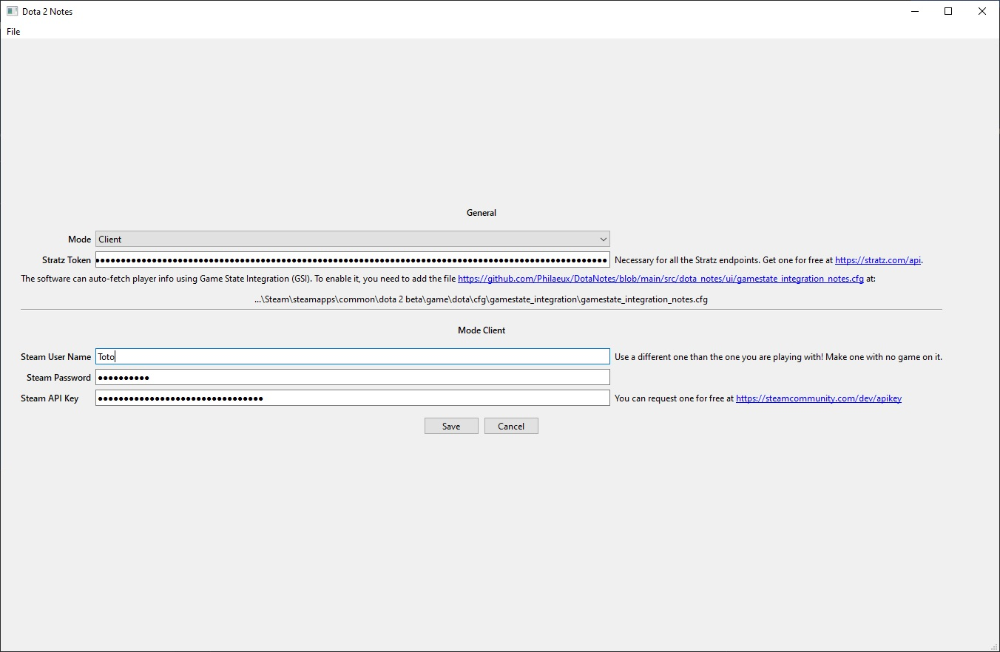
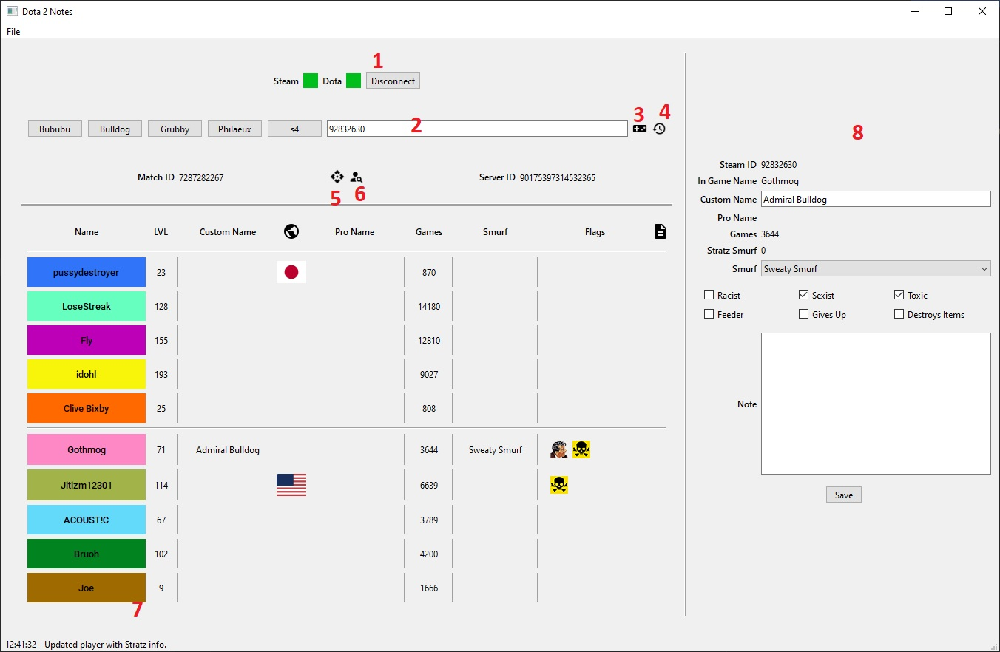

# DotaNotes
Software to add notes about Dota players met in matchmaking.

### User Manual
Make sure you are using the latest version from [the release page](https://github.com/Philaeux/DotaNotes/releases).
Be aware that the extra information you set are saved in the ``sqlite.db``. So if you update the software to a new version, bring the database to the new one.

Before using the software, you need to set some settings of the application

* Mode can only be Client
* If you want the software to display the information about the game you are watching, you need to setup GSI. Add [this file](https://github.com/Philaeux/DotaNotes/blob/main/docs/gamestate_integration_notes.cfg) in your Dota config folder: `\Steam\steamapps\common\dota 2 beta\game\dota\cfg\gamestate_integration\gamestate_integration_notes.cfg`
* The Stratz token is used for all Stratz endpoints (buttons 4, 5 & 6). Get one for free on their [website](https://stratz.com/api).
* To detect what game a user is in, you need to setup a Steam account and a Steam API Key. Make an extra steam account for free on their website. Get a free Steam API Key on their website [here](https://steamcommunity.com/dev/apikey).

* 1: Connect or disconnect the Steam Client to enable the button 3 (live detect).
* 2: Specify a SteamID to be used for the search with buttons 3 & 4.
* 3: Use the Steam Client to find the server where a user is playing, then use the Steam API to get information about the game.
* 4: Use Stratz to find the last game played by a user.
* 5: Use Stratz to find the game from the "Top Watch" section. To be used with GSI, if you are a top player, you don't need to setup the steam client/API Key. Instead GSI will fill the `match_id` and this button will fill other information.
* 6: Use Stratz to get player info. Use it after button 3, or after GSI fill user data.
* 7: Player info panels, click on a player to have his info on details panel.
* 8: Player details panel. Possible to set extra info about a player like flags, smurf and notes.

### Developer Manual
The project is design for python ``3.9+``. If you want to modify `.ui` files, use QTDesigner. See Makefile to have extra info about each commands

``{sys}`` can be either `unix` or `win`:
* ``{sys}-install``: Install a virtual environment and the required packages used by the program
* ``{sys}-run``: Start the program from the sources
* ``{sys}-clean``: remove all generated files
* ``{sys}-gen-ui``: generate ui python file `ui_main_window.py` from `ui_main_window.ui` (automatic call from ``{sys}-run``)
* ``{sys}-gen-resources``: generate resource python file `resources_rc.py` from `resources.qrc` (automatic call from ``{sys}-run``)
* ``{sys}-build``: generate a final build for users
